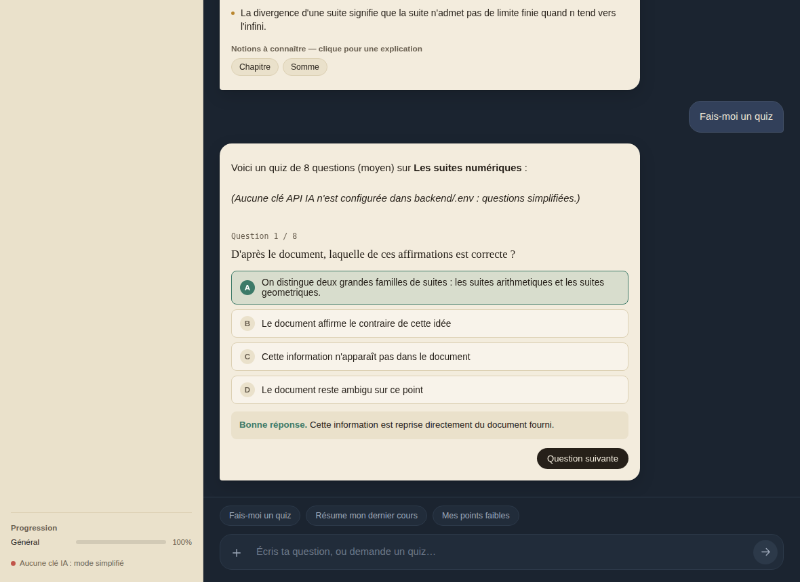

# 📘 Study — assistant de révision par chat


Un chatbot qui lit tes cours en PDF, les résume, en tire les points essentiels, t'interroge avec des quiz, repère ce que tu ne maîtrises pas encore et te l'explique. Tu peux aussi lui donner tes **examens passés** : il les garde en mémoire et s'en sert pour préparer des quiz dans le même esprit.

Tout est mémorisé dans une base de données locale : si tu fermes la page ou redémarres le serveur, la conversation, les documents et ta progression sont toujours là.



---

## Ce que fait l'application

| Tu fais…                                   | Le chatbot…                                                                                          |
|--------------------------------------------|------------------------------------------------------------------------------------------------------|
| Tu ajoutes un **cours** (PDF)              | Le lit, écrit un résumé, liste les **points essentiels** et les **notions clés**                     |
| Tu ajoutes un **examen passé** (PDF)       | Repère les thèmes qui reviennent et les questions déjà tombées, puis les garde en mémoire            |
| Tu demandes « Fais-moi un quiz »           | Génère un QCM à partir de tes cours (et s'inspire de tes examens), corrige chaque réponse et explique tes erreurs |
| Tu demandes « Mes points faibles »         | Classe les notions selon tes résultats aux quiz et te propose de te les expliquer                    |
| Tu cliques sur une notion                  | T'explique cette notion simplement, avec un exemple et une astuce pour la retenir                    |
| Tu poses une question libre                | Répond en s'appuyant sur les passages de tes documents qui parlent du sujet                          |

Exemples de phrases comprises directement dans le chat : « Résume le cours de maths », « Fais-moi un quiz difficile de 5 questions », « Explique-moi : suite géométrique », « Quels sont mes points faibles ? ».

---

## Installation

Il te faut **Python 3.9 ou plus** (testé avec Python 3.12) et une **clé API** Gemini ou OpenAI.

```bash
# 1. Aller dans le dossier backend
cd backend

# 2. (Recommandé) créer un environnement virtuel
python -m venv venv
# Windows :   venv\Scripts\activate
# Mac/Linux : source venv/bin/activate

# 3. Installer les dépendances
pip install -r requirements.txt

# 4. Configurer ta clé API
#    Copie .env.example en .env, puis ouvre .env et colle ta clé
#    Windows :   copy .env.example .env
#    Mac/Linux : cp .env.example .env

# 5. Lancer le serveur
python app.py
```

Ouvre ensuite **http://localhost:5001** dans ton navigateur. C'est tout : le même serveur affiche l'interface et répond aux requêtes (il n'y a plus qu'un seul programme à lancer).

### Où trouver une clé API ?

- **Gemini** (offre gratuite avec quota) : https://aistudio.google.com/app/apikey, à mettre dans `GEMINI_API_KEY`. Sur l'offre gratuite, Google peut réutiliser les contenus envoyés pour améliorer ses produits : évite d'y mettre des documents confidentiels.
- **OpenAI** (payant à l'usage) : https://platform.openai.com/api-keys, à mettre dans `OPENAI_API_KEY`

Si tu n'as encore aucune clé, l'application démarre quand même en **mode simplifié** (résumés et quiz basiques sans IA), pratique pour tester l'interface.

Le petit voyant en bas à gauche de la page fait un vrai test de connexion au démarrage : vert = clé et modèle fonctionnent, rouge = il y a un problème (le message explique lequel).

### Les modèles d'IA changent souvent

Les fournisseurs retirent leurs anciens modèles environ un an après leur sortie (par exemple `gemini-2.0-flash` a été arrêté en juin 2026). Les modèles par défaut de ce projet sont `gemini-3.8-flash` et `gpt-5.4-mini`, valables en septembre 2026. Si un jour l'application affiche « modèle introuvable », il suffit de mettre un modèle actuel dans `backend/.env` (`GEMINI_MODEL=...` ou `OPENAI_MODEL=...`), sans toucher au code. Note aussi que le paquet Python `google-generativeai` (ancien SDK) n'est plus maintenu : ce projet utilise son successeur `google-genai`.

---

## Organisation du projet

```
quiz-chatbot/
├── backend/
│   ├── app.py                 Serveur Flask : routes de l'API + service de la page web
│   ├── ai_provider.py         Appel unique au modèle d'IA (Gemini ou OpenAI, détecté via .env)
│   ├── database.py            Base SQLite : documents, extraits, questions, réponses, conversation
│   ├── pdf_processor.py       Lecture du PDF, nettoyage du texte, découpage en extraits
│   ├── documents_service.py   Ce qui se passe à l'envoi d'un PDF (résumé de cours / analyse d'examen)
│   ├── quiz_service.py        Génération des quiz, correction, explications
│   ├── chat_service.py        Comprend le message de l'élève et choisit quoi répondre
│   ├── retrieval.py           Retrouve les passages de cours utiles pour répondre à une question
│   ├── requirements.txt
│   └── .env.example
├── frontend/
│   ├── index.html
│   ├── style.css
│   └── script.js
└── uploads/                   Les PDF envoyés sont rangés ici
```

L'idée générale : chaque fichier a **un seul rôle**. `app.py` ne fait que recevoir les requêtes et appeler les services ; les services contiennent la logique ; `database.py` est le seul à parler à la base ; `ai_provider.py` est le seul à parler à l'IA. Si un jour tu changes de fournisseur d'IA, tu ne modifies qu'un fichier.

---

## Comment ça marche (et ses limites)

**La mémoire.** Chaque message, chaque quiz et chaque réponse sont enregistrés dans `backend/quiz.db`. Au rechargement de la page, l'historique est relu depuis cette base, et un quiz en cours reprend à la première question sans réponse.

**Répondre à partir de tes cours.** Quand tu poses une question, l'application ne renvoie pas tout le cours à l'IA (trop long, trop coûteux). Elle sélectionne les quelques passages qui partagent le plus de mots avec ta question (`retrieval.py`), puis les transmet à l'IA avec les derniers messages de la conversation. C'est une recherche **par mots-clés**, volontairement simple : elle ne demande aucun service supplémentaire, mais elle ne comprend pas les synonymes. Pour aller plus loin, on peut la remplacer par une recherche par *embeddings* (base vectorielle).

**Suivre tes points faibles.** Chaque question de quiz est rattachée à une *notion* (par exemple « Convergence »). À chaque réponse, le score de cette notion est mis à jour ; les notions sous 70 % de réussite sont signalées comme points faibles.

**Les examens passés.** Ils ne sont pas rejoués tels quels : l'IA en extrait les thèmes et les questions déjà posées, et ces documents servent de contexte pour générer des quiz du même style.

**À savoir :**
- Un PDF composé uniquement d'images (cours scanné) ne contient pas de texte à extraire : il sera refusé. Il faudrait ajouter une étape d'OCR.
- L'application est prévue pour **un seul élève, en local** (pas de comptes ni de mots de passe).
- La qualité des résumés et des quiz dépend du modèle d'IA utilisé et de la qualité du PDF.
- Les explications personnalisées données après une mauvaise réponse ne sont pas conservées : après rechargement, c'est l'explication générale de la question qui s'affiche.

---

## Dépannage

| Problème                                          | Solution                                                                                     |
|---------------------------------------------------|----------------------------------------------------------------------------------------------|
| Voyant rouge « Aucune clé IA »                    | Vérifie que `backend/.env` existe et contient bien ta clé, puis relance `python app.py`      |
| Voyant rouge « modèle introuvable »               | Le modèle a été retiré : mets un modèle actuel dans `GEMINI_MODEL` ou `OPENAI_MODEL` (voir `.env.example`) |
| Message « quota atteint »                         | Attends quelques minutes, ou passe à un modèle plus léger (ex. `GEMINI_MODEL=gemini-3.5-flash-lite`) |
| `ModuleNotFoundError`                             | Active ton environnement virtuel puis relance `pip install -r requirements.txt`              |
| « Impossible d'extraire du texte de ce PDF »      | Le PDF est probablement scanné (images) ou protégé : essaie un PDF dont tu peux sélectionner le texte |
| Le quiz contient des questions étranges           | Tu es en mode simplifié (pas de clé IA) : configure une clé pour de vrais QCM                |
| Le port 5001 est déjà utilisé                     | Ajoute `PORT=5002` dans `backend/.env`                                                       |
| Repartir de zéro                                  | Arrête le serveur, supprime `backend/quiz.db` et vide le dossier `uploads/`                  |

---

## Idées pour la suite

- OCR pour lire les cours scannés
- Recherche par embeddings à la place des mots-clés
- Comptes utilisateurs, pour que plusieurs élèves partagent le même serveur
- Mode « révision espacée » : reproposer les notions faibles au bon moment
- Export des fiches de révision en PDF

---

## Licence

Ce projet est sous licence [MIT](LICENSE) : libre à toi de le réutiliser, le modifier et le partager. Pense à remplacer `[Ton nom]` dans le fichier `LICENSE` par le tien avant de publier.
